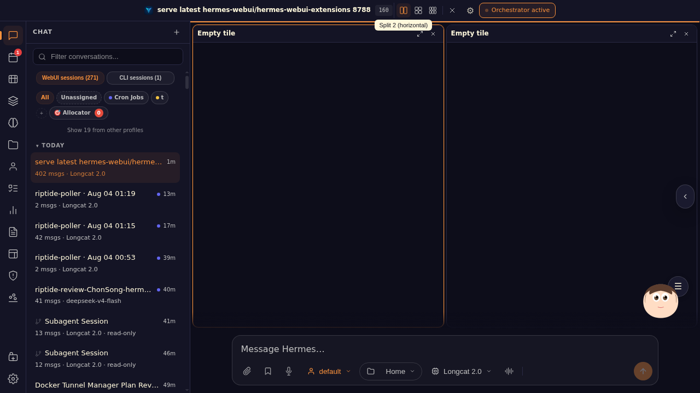

# ProofShot Verification Report

**Date:** 2026-08-03 15:34:43
**Project:** hermes-webui-extensions
**Dev Server:** external on localhost:3000

## What Was Verified

Chat Tiling debug v2

## Video Recording

Full session recording: [session.webm](./session.webm) (127s)

## Screenshots

## Console Errors

No console errors detected.

## Server Errors

No server errors detected.

## Token Usage (Estimated)

- Input tokens: ~7,500
- Output tokens: ~4,500
- Total tokens: ~12,000
- Estimated cost: ~$0.0900
- Source: estimated from session activity

## Environment
- Browser: Chromium (headless)
- Viewport: 1280x720
- Duration: 127 seconds
