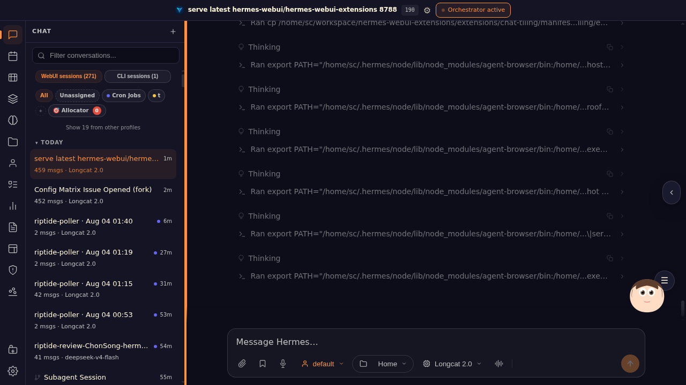
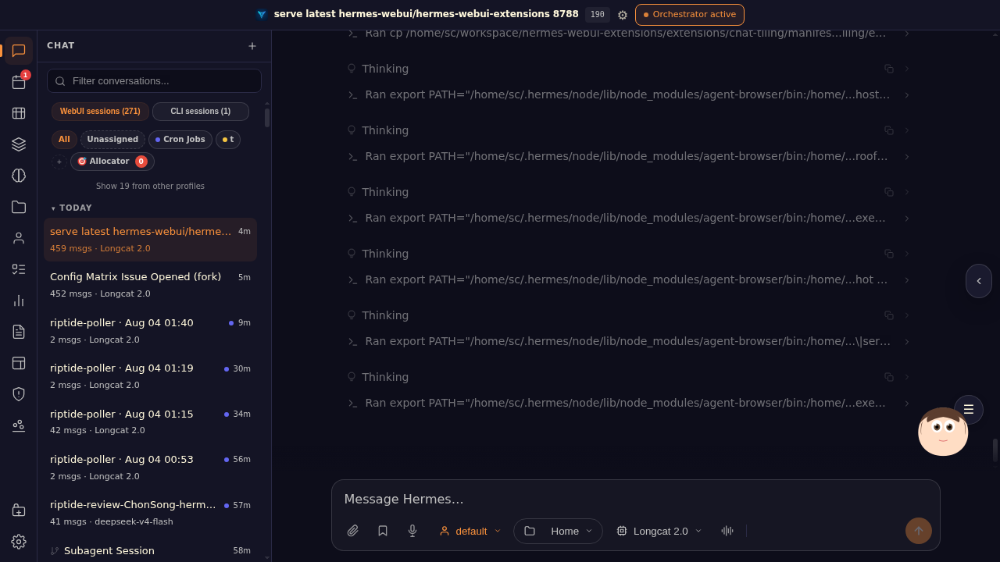

# ProofShot Verification Report

**Date:** 2026-08-03 15:50:56
**Project:** hermes-webui-extensions
**Dev Server:** external on localhost:3000

## Video Recording

Full session recording: [session.webm](./session.webm) (328s)

## Screenshots

## Console Errors

No console errors detected.

## Server Errors

No server errors detected.

## Token Usage (Estimated)

- Input tokens: ~14,000
- Output tokens: ~8,400
- Total tokens: ~22,400
- Estimated cost: ~$0.1680
- Source: estimated from session activity

## Environment
- Browser: Chromium (headless)
- Viewport: 1280x720
- Duration: 328 seconds
